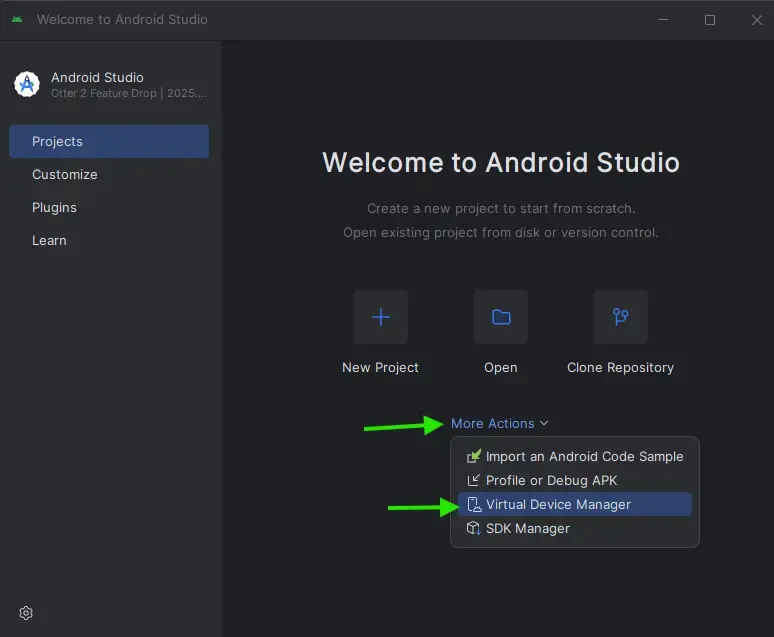
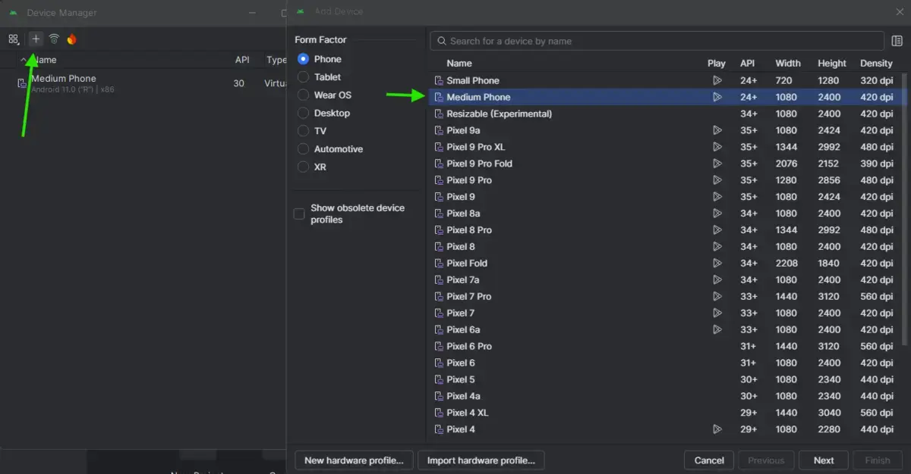
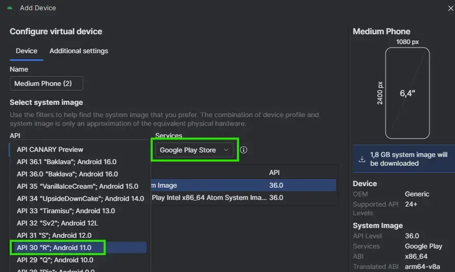
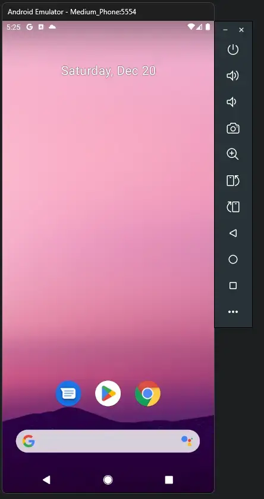
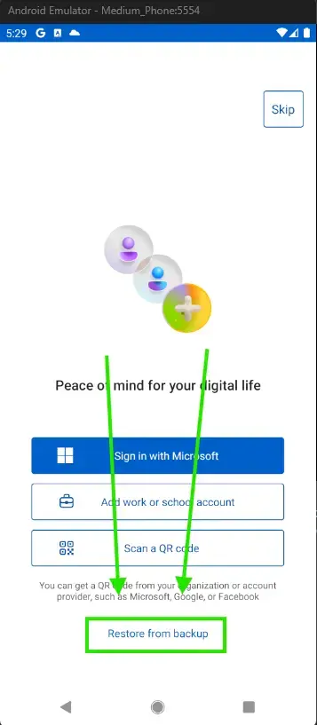
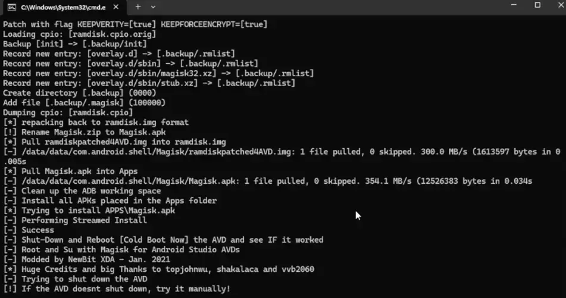
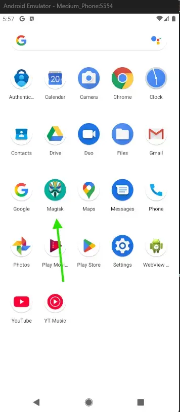
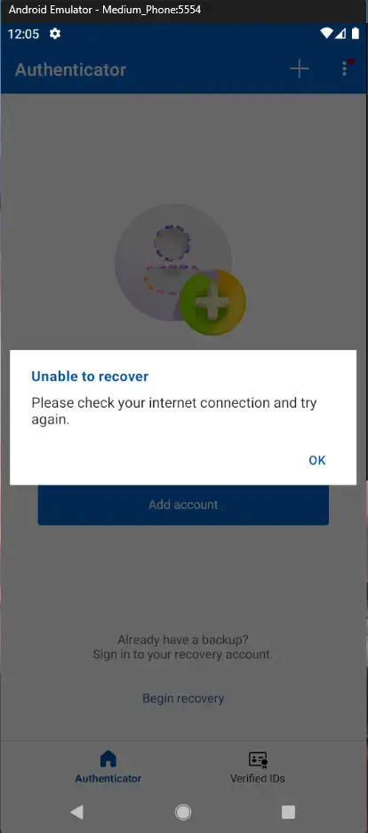
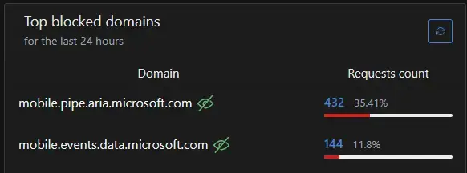

**Salut! Si tu es ici juste pour les étapes, [saute ici](#ce-dont-tu-as-besoin)**. Aussi, **si tu as moins de 10 comptes** et que ton téléphone **n'est pas rooté** (sans root, c'est plus long), **je recommande fortement de changer manuellement ton 2FA dans les paramètres de tes comptes**, parce que tout ce qui suit va te prendre plus de temps. Bref, bonne lecture.

>[!WARNING]
>**Microsoft a récemment ajouté une petite mise à jour bien cachée sur [leur site de support](https://web.archive.org/web/20251220181040/https://support.microsoft.com/fr-fr/account-billing/%C3%A0-propos-de-l-application-microsoft-authenticator-9783c865-0308-42fb-a519-8cf666fe0acc) qui indique** :
>
>*« À compter de février 2026, **nous allons introduire la détection jailbreak/racine** pour les informations d'identification Entra professionnelles/scolaires dans Microsoft Authenticator. Cette modification améliore la sécurité en **empêchant les informations d'identification Authenticator Entra de fonctionner sur les appareils jailbreakés ou rootés**.»*
>
>[On dirait vraiment qu'ils veulent te garder pris avec eux](https://www.explainxkcd.com/wiki/index.php/2522:_Two-Factor_Security_Key)... Je suis pas mal sûr qu'il y aura toujours des façons d'extraire des tokens TOTP. Peut-être que ce sera juste plus compliqué ou plus long. N'hésite pas à essayer et à laisser une commande pour dire aux autres si ça fonctionne encore. **De ce que je comprends présentement, ça devrait encore marcher**.


Récemment, j'ai recommencé à revoir, ou plutôt à créer, un vrai "disaster recovery plan" pour mes données. Quand on pense au sauvegardes, la première chose qui nous vient en tête, c'est souvent le stockage disque. Mais aujourd'hui, les comptes et services en ligne des grandes (et petites!) compagnies prennent une place énorme dans notre vie quotidienne, que ce soit pour le divertissement ou les communications. Mon plan de reprise inclut donc aussi les informations de comptes en ligne, ce qui comprend les tokens TOTP.

J'utilise Microsoft Authenticator depuis plus de 4 ans maintenant. À l'époque, ma raison principale était sa fonction de sauvegarde en ligne. J'étais bien sûr au courant des alternatives open source, mais je n'étais pas assez en confiance pour gérer mes propres données moi-même. Si j'avais à faire une "review" de Microsoft Authenticator, je dirais que c'est une bonne application. Elle fonctionne bien et fait exactement ce qu'on lui demande. Par contre, ils ont récemment retiré le support des mots de passe pour forcer les utilisateurs à migrer vers Edge... Un classique de Microsoft. Et c'est précisément à ce moment-là que je me suis rappelé que dépendre d'une grosse compagnie, c'est facile, mais ils peuvent aussi te planter sans trop de conséquences.

Perdre l'accès à l'application sur ton téléphone, peu importe la raison, veut dire perdre l'accès à tous tes comptes. Et à ce stade-là, j'avais déjà vu plusieurs publications d'utilisateurs disant que la restauration de Microsoft Authenticator ne fonctionnait pas toujours ou prenait parfois plusieurs jours. [On va revenir là-dessus un peu plus loin](#story-time---pourquoi-la-restauration-a-pris-3-heures).

---

# Ce dont tu as besoin
Bon, d'abord et avant tout, quand j'ai décidé d'extraire ces tokens, j'étais déterminé à **ne pas déverrouiller mon bootloader ni rooter mon téléphone**. **Tu n'as donc pas besoin d'un téléphone rooté**, mais si le tien l'est, ça va aller plus vite (je vais donner les étapes pour les téléphones non rootés. *Si ton téléphone est rooté, je vais assumer que tu sais quelles étapes te concernent*).

**J'ai fait tout ça sur Windows 11**, et ça a pris environ 20 Go sur mon disque. D'après ce que j'ai vu en ligne, c'est aussi possible sur Linux et macOS.  
Voici ce dont tu auras besoin :
1. [Android Studio](https://developer.android.com/studio) (pour l'émulateur Android. *Si ton téléphone est rooté, tu n'en as pas besoin*)
    * **Consulte les exigences de l'émulateur Android** : https://developer.android.com/studio/run/emulator. Tu devras peut-être **activer la virtualisation dans ton BIOS**.
2. [rootAVD](https://gitlab.com/newbit/rootAVD) (pour rooter le téléphone Android émulé)
3. **Assure-toi d'avoir activé les sauvegardes en ligne dans Microsoft Authenticator.**

# On commence
Cette partie assume que tu as installé Android Studio, activé la virtualisation, téléchargé rootAVD et activée la sauvegarde en ligne.

### Android Studio
1. D'abord, ouvre Android Studio puis l'**Android Device Emulator / Device Manager**.

    
2. Dans le Device Manager, **crée un nouvel appareil virtuel**. Personnellement, **j'ai choisi le type Medium Phone**.

    
3. Dans les paramètres de l'appareil virtuel, sélectionne une version d'Android supportée par Microsoft Authenticator. J'ai choisi **Android 11 (API 30)**, parce que j'ai lu que rooter des versions plus récentes avec rootAVD peut causer des problèmes et demander plus d'étapes. **Assure-toi aussi que les services du Play Store sont inclus**, puisque tu en auras besoin pour installer Microsoft Authenticator depuis le Play Store.

    
4. Une fois tous les paramètres configurés, clique sur **Next / Finish**. Android Studio peut te demander d'accepter de nouvelles conditions et télécharger des fichiers. Une fois terminé, ton téléphone virtuel devrait être prêt.
5. Dans la fenêtre du Device Manager, à côté de ton nouveau téléphone virtuel, clique sur le bouton **Play** (l'icône) pour le démarrer. Une fois démarré, fais la configuration de base et installe Microsoft Authenticator. ***Si tu utilises le Play Store, tu devras te connecter à un compte Google***.

    

### Restaurer les codes TOTP depuis Microsoft Authenticator
1. À l'intérieur de l'application, lors de la configuration initiale, appuie sur le bouton **Restore from backup** et connecte ton compte Microsoft. ***Si tout va bien***, ça devrait prendre environ 15 secondes. Pour moi, ça n'a pas été le cas : ça m'a pris plus de 3 heures d'essais, [j'en reparle plus loin](#story-time---pourquoi-la-restauration-a-pris-3-heures).

    

### Rooter le téléphone virtuel
Parfait! Le notre émulateur fonctionne et Authenticator a restauré une copie des tokens TOTP. Maintenant, on va rooter le téléphone avec **rootAVD**[^1].

1. Ouvre une invite de commandes et définis le dossier de rootAVD comme répertoire courant avec la commande `cd chemin-complet`.
2. Exécute le fichier batch `rootAVD.bat` en tapant `rootAVD.bat ListAllAVDs`. Vous devriez obtenir un résultat similaire à celui-ci :
```text
Command Examples:
rootAVD.bat
rootAVD.bat ListAllAVDs
rootAVD.bat InstallApps

rootAVD.bat system-images\android-36.1\google_apis_playstore\x86_64\ramdisk.img
rootAVD.bat system-images\android-36.1\google_apis_playstore\x86_64\ramdisk.img FAKEBOOTIMG
rootAVD.bat system-images\android-36.1\google_apis_playstore\x86_64\ramdisk.img DEBUG PATCHFSTAB GetUSBHPmodZ
rootAVD.bat system-images\android-36.1\google_apis_playstore\x86_64\ramdisk.img restore
rootAVD.bat system-images\android-36.1\google_apis_playstore\x86_64\ramdisk.img InstallKernelModules
rootAVD.bat system-images\android-36.1\google_apis_playstore\x86_64\ramdisk.img InstallPrebuiltKernelModules
rootAVD.bat system-images\android-36.1\google_apis_playstore\x86_64\ramdisk.img InstallPrebuiltKernelModules GetUSBHPmodZ PATCHFSTAB DEBUG

rootAVD.bat system-images\android-33\google_apis_playstore\x86_64\ramdisk.img
rootAVD.bat system-images\android-33\google_apis_playstore\x86_64\ramdisk.img FAKEBOOTIMG
rootAVD.bat system-images\android-33\google_apis_playstore\x86_64\ramdisk.img DEBUG PATCHFSTAB GetUSBHPmodZ
rootAVD.bat system-images\android-33\google_apis_playstore\x86_64\ramdisk.img restore
rootAVD.bat system-images\android-33\google_apis_playstore\x86_64\ramdisk.img InstallKernelModules
rootAVD.bat system-images\android-33\google_apis_playstore\x86_64\ramdisk.img InstallPrebuiltKernelModules
rootAVD.bat system-images\android-33\google_apis_playstore\x86_64\ramdisk.img InstallPrebuiltKernelModules GetUSBHPmodZ PATCHFSTAB DEBUG

rootAVD.bat system-images\android-30\google_apis_playstore\x86\ramdisk.img
rootAVD.bat system-images\android-30\google_apis_playstore\x86\ramdisk.img FAKEBOOTIMG
rootAVD.bat system-images\android-30\google_apis_playstore\x86\ramdisk.img DEBUG PATCHFSTAB GetUSBHPmodZ
rootAVD.bat system-images\android-30\google_apis_playstore\x86\ramdisk.img restore
rootAVD.bat system-images\android-30\google_apis_playstore\x86\ramdisk.img InstallKernelModules
rootAVD.bat system-images\android-30\google_apis_playstore\x86\ramdisk.img InstallPrebuiltKernelModules
rootAVD.bat system-images\android-30\google_apis_playstore\x86\ramdisk.img InstallPrebuiltKernelModules GetUSBHPmodZ PATCHFSTAB DEBUG
```
3. Ici, **on veut sélectionner la version Android du téléphone virtuel présentement en cours d'exécution**. J'utilisais Android 11, **version API 30**. Ça veut donc dire que ma prochaine commande devrait être :

    `rootAVD.bat system-images\android-30\google_apis_playstore\x86\ramdisk.img`

>[!NOTE]
> Si tu vois plusieurs erreurs disant que **adb** n'est pas reconnu comme une commande interne, exécute `set PATH=%PATH%;%LOCALAPPDATA%\Android\sdk\platform-tools`  
> et réessaie. J'ai eu ce problème, on dirait qu'Android Studio n'avait pas enregistré son chemin bin dans ma variable d'environnement utilisateur.

4. **Si on te demande de choisir une version de Magisk, sélectionne la version stable.** Si tout est correct, attends 1 à 2 minutes et ton téléphone virtuel devrait se fermer tout seul. **Garde l'invite de commandes ouverte, on va s'en servir plus tard.**

    

5. Une fois que le téléphone virtuel s'est fermé (ou après 2 minutes), redémarre-le et cherche une application appelée **Magisk**. Ouvre-la et complète la configuration. Le téléphone peut redémarrer.

    

### Exporter depuis Microsoft Authenticator
Tu es presque rendu! Encore quelques étapes...

1. Dans l'invite de commandes que tu as utilisée pour rooter ton téléphone virtuel, exécute la commande `adb shell` pour établir une connexion shell avec le téléphone.
2. Dans ce shell, passe en mode root en tapant `su`. **Sur le téléphone, il se peut qu'une fenêtre Magisk apparaisse pour te demander si tu veux accorder les permissions super-utilisateur au processus shell. *Tu dois appuyer sur Oui***. Dans la console, tape `whoami`. Si tu vois `root`, félicitations, tu es maintenant un super-utilisateur.
3. Maintenant, on va utiliser tes permissions super-utilisateur pour **copier les données protégées de l'application Microsoft Authenticator**. Copie-les sur une fausse carte SD **en exécutant la commande** :  
   `cp -r /data/data/com.azure.authenticator/databases/ /sdcard/db_backup/`.
4. Parfait, maintenant que les données protégées ont été copiées dans un répertoire non protégé, on peut quitter le shell en écrivant `exit` deux fois. (*Une fois pour fermer le shell super-utilisateur, une autre pour quitter le shell normal*)
5. Ensuite, il faut récupérer une copie des fichiers du téléphone virtuel vers notre machine Windows. Pour ce faire, exécute :  
   `adb pull /sdcard/db_backup ./auth_databases_backup`  
   Cela va créer un nouveau dossier appelé **auth_databases_backup** dans ton répertoire **rootAVD**.
6. Dans ce dossier, tu devrais voir 3 fichiers qui commencent par **PhoneFactor**. Dans ton invite de commandes, tape :  
   `sqlite3 .\auth_databases_backup\PhoneFactor`  
   Tu devrais voir quelque chose comme ceci :
    ```text
    Enter ".help" for usage hints.
    sqlite>
    ```
    Tape ensuite :  
    `PRAGMA wal_checkpoint(TRUNCATE);`  
    et fais **Ctrl+C** deux fois pour quitter le shell sqlite.

>[!TIP]
> La partie sqlite3 n'est pas absolument nécessaire, mais comme la base de données était en mode WAL (Write-Ahead Logging) et que la restauration et l'extraction ont été effectuées rapidement, dans mon cas, le fichier DB n'avait pas encore enregistré toutes les modifications (checkpoint).

6. **Tu as maintenant extrait tes tokens TOTP avec succès!** Voici un script Python[^2] qui analysera ton fichier SQLite et le convertira en fichier texte. Si tu ne veux pas utiliser Python, tu peux ouvrir le fichier **PhoneFactor** dans n'importe quel visualiseur SQLite local.
    ```python
    import sqlite3

    # connect to sqlite3 database named PhoneFactor in current directory
    conn = sqlite3.connect('PhoneFactor')
    cursor = conn.cursor()

    # execute SQL query — only select account_type = 0
    cursor.execute("SELECT name, username, oath_secret_key FROM accounts WHERE account_type = 0")

    # open text file for writing
    with open("auth_accounts.txt", "w", encoding="utf-8") as f:
        # loop through each row
        for row in cursor.fetchall():
            name, username, secret_key = row
            # write to file
            f.write(f"Account: {name}\n")
            f.write(f"Username: {username}\n")
            f.write(f"Secret Token: {secret_key}\n")
            f.write("\n")  # blank line between entries

    # close database connection
    conn.close()

    print("Done - results saved to auth_accounts.txt")

    ```
    

## Histoire - Pourquoi la restauration a pris 3 heures?

Bon, j'ai installé Authenticator, appuyé sur **Restore**, et connecté mon compte. *Assez simple...* **Non??**



Eh bien, en fait, non. J'ai essayé plein de choses : vider complètement le cache de l'application, la désinstaller et la réinstaller, supprimer ma sauvegarde et en créer une nouvelle sur mon vrai téléphone, créer un nouveau téléphone virtuel, et plus.

Le message d'erreur ne faisait pas beaucoup de sens pour moi. Pas de connexion? Je venais juste de connecter mon compte Microsoft. Comment est-ce possible sans connexion? Même une recherche sur Google fonctionnait.

Alors j'ai fouillé en ligne et j'ai trouvé quelques utilisateurs, comme dans ce [post Reddit](https://www.reddit.com/r/entra/comments/1ossj69/microsoft_authenticator_app_on_android_16_pixel/) ou cette [question sur Microsoft Learn](https://learn.microsoft.com/en-us/answers/questions/5615066/microsoft-authentificator-on-restore-check-your-in), qui avaient rencontré les mêmes problèmes récemment. La plupart des posts mentionnaient des choses que j'avais déjà essayées. Certains disaient qu'il avait dû refaire la restauration jusqu'à 10 fois (sans succès), etc. Au final, j'ai arrêté d'essayer et j'ai supposé que c'était probablement un bug côté Microsoft, donc j'ai soumis un rapport de bogue et, pas trop longtemps après, je suis allé dormir.

Le lendemain, j'ai réessayé, sans succès. Le même message d'erreur, ou parfois une fenêtre qui indiquait directement qu'une erreur inattendue était survenue. J'ai continué à essayer quelques trucs quand j'ai eu une idée, et si le téléphone virtuel utilisait le même DNS que mon ordinateur (un serveur AdGuardHome) et qu'il était bloqué? Je suis allé dans le panneau d'administration d'AdGuardHome et, bingo, la première chose que j'ai vue était un nouveau domaine que je n'avais jamais vu avant. Après une recherche rapide, d'autres utilisateurs qui bloquaient ce domaine (`mobile.pipe.aria.microsoft.com`) avaient aussi des problèmes avec d'autres services Microsoft.



Alors, qu'est-ce que j'ai fait? J'ai redémarré le téléphone virtuel, suis allé dans les paramètres Wi-Fi, et mis le **DNS privé** sur `dns.adguard-dns.com`, ce qui a empêcher l'utilisation de mon AdGuardHome local. J'ai tenté une restauration et **tout a fonctionné en moins de 15 secondes**.

Je suppose... que c'est toujours le DNS.

## Crédits
Je tiens à remercier [chowder](https://gist.github.com/chowder/2ead734d60d84d4d15034fcce81aaaf9) sur GitHub pour son gist qui m'ont montré que c'était bel et bien possible. Ça fait maintenant quelques semaines que je cherchais des infos en ligne, et la plupart des résultats affirmaient que ce n'était pas possible via l'interface de l'application elle-même. J'étais sûr qu'il devait y avoir une solution, mais je ne connaissais pas assez l'écosystème Android pour le faire moi-même. Sont gist ma donné les bases qui m'ont permis de chercher les bonnes choses en ligne. J'ai compris le reste par moi-même.

[^1]: J'ai utilisé [cette vidéo](https://www.youtube-nocookie.com/embed/QzsNn3GhYYk) pour m'assurer que j'utilisais rootAVD correctement.  
[^2]: Le script Python est inspiré de [ce petit post](https://blog.jsfr.work/%E7%94%9F%E6%B4%BB%E8%AE%B0%E5%BD%95/Export-OTP-From-Microsoft-Authenticator.html) que j'ai découvert en rédigeant celui-ci.