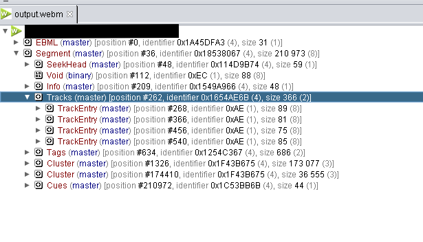
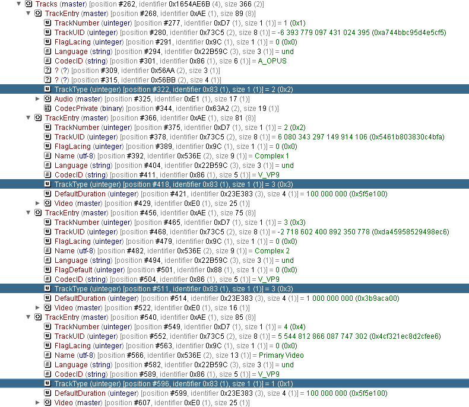
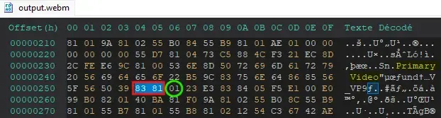

This is the story of how I tried recreating a "glitched" WebM file I came across a couple of years ago.
This post is a revised version of my own old [Github Gist](https://gist.github.com/kitsumed/20fa8410514e560400c0c02ecf8c3b46).

---

I recently encountered an intriguing WebM file that played different videos depending on the device or software used. Specifically, the video varied between Firefox, Chromium-based browsers/Electron apps, and Android.

Curious about how it worked, I searched online but found no relevant information. At first, I thought the video might have had multiple video sources, but after checking with VLC, I found only a single audio source. To investigate further, I examined the file's bytes and saw that there were multiple tracks, but I couldn't understand how it worked.  

After a couple of hours and running out of ideas, I decided to open the [URL in the metadata](https://pious.dev/) that credited the original creator [@piousdeer](https://github.com/piousdeer) and reached out to them.

The creator responded and recommended an old Java program called [EBML Viewer](https://code.google.com/archive/p/ebml-viewer/downloads). They advised me to pay close attention to the **[TrackType](https://www.matroska.org/technical/elements.html#:~:text=TrackType)** field.

After messing around a bit in the program, I realized my initial guess was right, multiple tracks were in the file, with the only difference being the `TrackType` value. One track was `2` (audio), another was `1` (video), and the remaining two were `3` (complex).  




I then tried to craft my own webm file by first using the following FFmpeg command: `ffmpeg -i video1.mp4 -i video2.mp4 -i video2.mp4 -map 0:a:0 -map 0:v:0 -map 1:v:0 -map 2:v:0 -c:v libvpx-vp9 -c:a libopus -b:a 256k -metadata:s:v:0 title=Complex 1 -metadata:s:v:1 "title=Complex 2" -metadata:s:v:2 "title=Primary Video" output.webm`

**This had the effect of creating a webm file with 4 `TrackEntity`**. One audio (`TrackType=2`) and three video (`TrackType=1`). It seems that FFmpeg does not support `TrackType=3`.
Regardless, **in the current state of the file, playing it in Firefox and Android would already play a different video**.

> [!TIP]
> From my tests, for the file to play a different video on Android, the `TrackEntity` need to be created in the following order: `Audio`, `Video or Complex`, `Video or Complex`, `Video`

While different videos now play differently between Firefox and Android, the three audio sources are still visible when opening the file in VLC. This is where `TrackType 3` comes into play.

Since FFmpeg does not support it, the fastest way I know of doing it was editing it manually using a hex editor. I ended up using [HxD](https://mh-nexus.de/en/hxd/).

With the help of **EBML Viewer**, I discovered that the `TrackType` in hex was represented by `83 81`, followed by its value (in this case, `01`).

For a visual reference, here are the first bytes of the original WebM file. In this example, the last three pairs of bytes are the ones we're interested in:
```
1A 45 DF A3 9F 42 86 81 01 42 F7 81 01 42 F2 81 04 42 F3 81 08 42 82 84 77 65
62 6D 42 87 81 04 42 85 81 02 18 53 80 67 01 00 00 00 00 1D 7F AD 11 4D 9B 74
BB 4D BB 8B 53 AB 84 15 49 A9 66 53 AC 81 A1 4D BB 8B 53 AB 84 16 54 AE 6B 53
AC 81 D6 4D BB 8C 53 AB 84 12 54 C3 67 53 AC 82 02 53 4D BB 8D 53 AB 84 1C 53
BB 6B 53 AC 83 1D 7F 4F EC 01 00 00 00 00 00 00 58 00 00 00 00 00 00 00 00 00
00 00 00 00 00 00 00 00 00 00 00 00 00 00 00 00 00 00 00 00 00 00 00 00 00 00
00 00 00 00 00 00 00 00 00 00 00 00 00 00 00 00 00 00 00 00 00 00 00 00 00 00
00 00 00 00 00 00 00 00 00 00 00 00 00 00 00 00 00 00 00 00 00 00 00 00 00 00
00 15 49 A9 66 B0 2A D7 B1 83 0F 42 40 4D 80 8C 4C 61 76 66 36 31 2E 39 2E 31
30 30 57 41 8C 4C 61 76 66 36 31 2E 39 2E 31 30 30 44 89 88 40 C4 4E 80 00 00
00 00 16 54 AE 6B 41 77 AE 01 00 00 00 00 00 00 59 D7 81 01 73 C5 88 0F 52 42
BB B8 7A 09 47 9C 81 00 22 B5 9C 83 75 6E 64 86 86 41 5F 4F 50 55 53 56 AA 83
63 2E A0 56 BB 84 04 C4 B4 00 [83 81] (01) <-- TrackType is 01, so 1. It is a video.
```
To differentiate the two complex videos from the "Primary Video," I instructed FFmpeg to assign them different titles in their metadata when creating my own file.  


In HxD, the decoded text section on the right side of the hex view reveals these titles, allowing us to easily identify the `TrackEntity`. We can see the text "Complex 1," "Complex 2," and "Primary Video" embedded in the metadata.  
The first `TrackType` (`83 81`) that appears **after** the `TrackEntry` title belongs to that specific `TrackEntry`.  

> [!TIP]
> If you search for the bytes `83 81`, the first 4 results should correspond to your `TrackEntry` tracks. From there, you only need to identify the ones with "Complex" in their title.  

After identifying the positions of the two `TrackType` values corresponding to the tracks with "Complex" in their titles, we need to replace their values from `01` to `03`. This modification changes their `TrackType` from video to complex.

If we reopen the edited file in EBML Viewer, we should now see that both tracks with "Complex" in their title have their `TrackType` set to **3**.  

From this point, if you open your WebM file in a video player like [VLC](https://github.com/videolan/vlc), you should only see one track available, the track with type **1** (video) even though three "video" tracks exist in the file.

---

This is where I started to get confused again. I was satisfied because I now understood how it worked and managed to get a different video to play on Android devices. However, the file **@piousdeer** created was also playing a different video between Firefox/VLC and Chromium-based/Electron browsers.  

After discussing further with **@piousdeer**, I learned that the `Complex 1` video actually had two `TrackType` values: one set to `03` and the other set to `01`. This means its file was purposefully "corrupted" in a way that didn't respect the official format specs but still got parsed. I tried replicating this in the `TrackEntry` of `Complex 1` by replacing another field with a `TrackType` (`83 81`), but it didn’t have much effect, except for corrupting the file.

At this point, I was starting to get tired of trying things out and decided to stop my experiments. I was already happy because I understood how it worked and had all the answers, even though I didn’t manage to replicate the final step.  

I then created a detailed instructions prompt and asked ChatGPT to generate a Python script that would automatically run all of the steps I did manually. After fixing up the script, I had a working PoC, which I made available as a [GitHub Gist here](https://gist.github.com/kitsumed/20fa8410514e560400c0c02ecf8c3b46#file-poc-py).  

> **Note:** For the Python script to work, you need FFmpeg in your PATH environment variable or in the same directory as the Python file.
#### Credits
Thanks again to **@piousdeer** for his help as I don't think I would have learned about `TrackType` existence alone.
I would also like to credits [@19wintersp](https://github.com/19wintersp) who made the [same experiment](https://dev.to/19wintersp/reverse-engineering-a-weird-video-file-3og) in 2021, I found his blog after my experiments, when I already knew of `TrackType` but it was a interesting read. He seems to have managed to fully replicate it.